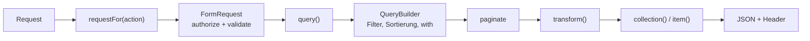
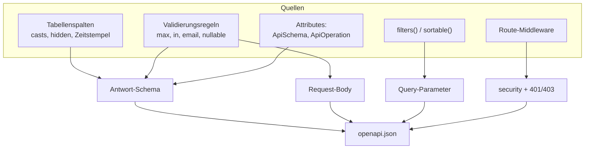
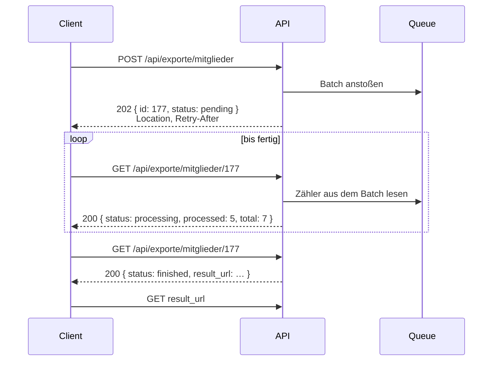
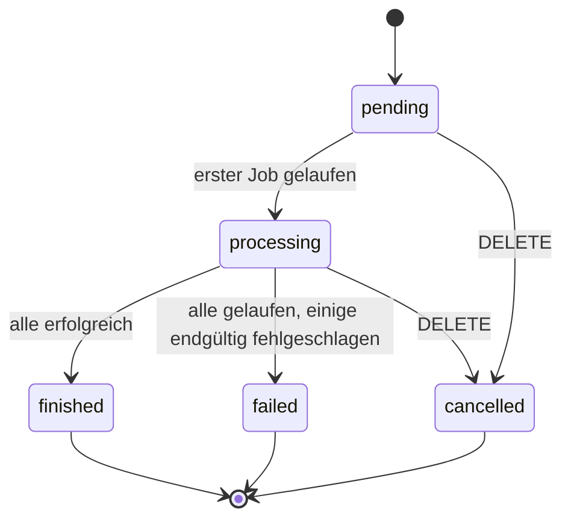

# didasto/rest-api

[](https://github.com/didasto/rest-api/actions/workflows/tests.yml)
[](https://github.com/didasto/rest-api/releases)
[](LICENSE)

**[English](README.EN.md) · [Deutsch](README.DE.md)**

Model-basierte und handgeschriebene REST-APIs für Laravel. Routing über
Attribute, ein OpenAPI-Dokument aus den eigenen Request-Klassen, und Filter,
die man deklariert statt implementiert.

Der Leitsatz dieses Packages: **nichts ist `final`, nichts ist `private`.**
Jede Stufe jedes Requests lässt sich einzeln ersetzen. Siehe
[Erweiterungspunkte](#erweiterungspunkte).

---

## Inhalt

- [Installation](#installation)
- [Eine Model-Ressource in drei Dateien](#eine-model-ressource-in-drei-dateien)
- [Der Weg eines Requests](#der-weg-eines-requests)
- [Filter](#filter)
- [Sortierung, Paginierung, Relationen](#sortierung-paginierung-relationen)
- [Das OpenAPI-Dokument](#das-openapi-dokument)
- [Geschützte Endpunkte](#geschützte-endpunkte)
- [Job-APIs](#job-apis)
- [Erweiterungspunkte](#erweiterungspunkte)
- [Konfiguration](#konfiguration)
- [Tests](#tests)

---

## Installation

**Voraussetzungen:** PHP 8.3 oder neuer, Laravel 12 oder 13.

```bash
composer require didasto/rest-api
php artisan migrate                 # nur für Job-APIs nötig
```

Optional die Konfiguration publizieren:

```bash
php artisan vendor:publish --tag=rest-api-config
```

> **Vorsicht bei einer publizierten Config.** Sie gewinnt als Ganzes gegen
> die Vorgaben des Packages — ein veraltetes `defaults.actions` lässt also
> stillschweigend Routen verschwinden. Bei einem unbekannten Aktionsnamen
> wirft das Package eine Exception und sagt genau das.

---

## Eine Model-Ressource in drei Dateien

**1. Der Controller** legt Model und Aktionen fest.

```php
use Didasto\RestApi\Attributes\RestResource;
use Didasto\RestApi\Http\Controllers\RestController;

#[RestResource(model: Mitglied::class, uri: 'mitglieder')]
class MitgliedController extends RestController
{
    public function requestFor(string $action): ?string
    {
        return match ($action) {
            'index'  => MitgliedIndexRequest::class,
            'store'  => MitgliedStoreRequest::class,
            'update' => MitgliedUpdateRequest::class,
            default  => null,
        };
    }
}
```

**2. Der Listen-Request** deklariert Filter und Sortierung.

```php
class MitgliedIndexRequest extends IndexRequest
{
    public function filters(): array
    {
        return [
            'id'        => IdFilter::class,
            'name'      => StringFilter::class,
            'saldo'     => NumericFilter::class,
            'eintritt'  => new DateFilter(column: 'eingetreten_am'),
        ];
    }

    public function sortable(): array
    {
        return ['id', 'name', 'saldo'];
    }
}
```

**3. Der Schreib-Request** deklariert die Regeln. Sie validieren die Eingabe
*und* beschreiben den Request-Body im OpenAPI-Dokument.

```php
class MitgliedStoreRequest extends RestRequest
{
    public function rules(): array
    {
        return [
            'name'  => ['required', 'string', 'max:120'],
            'email' => ['required', 'email'],
            'saldo' => ['numeric', 'between:0,9999.99'],
        ];
    }
}
```

Daraus entsteht:

| Aktion    | Route                              | Name                  |
|-----------|------------------------------------|-----------------------|
| `index`   | `GET /api/mitglieder`              | `mitglieder.index`    |
| `show`    | `GET /api/mitglieder/{id}`         | `mitglieder.show`     |
| `store`   | `POST /api/mitglieder`             | `mitglieder.store`    |
| `update`  | `PUT\|PATCH /api/mitglieder/{id}`  | `mitglieder.update`   |
| `destroy` | `DELETE /api/mitglieder/{id}`      | `mitglieder.destroy`  |

`only: ['index', 'show']` gibt nur diese beiden frei, `except: ['destroy']`
nimmt eine heraus.

`requestFor()` ist die einzige Stelle, an der steht, welcher Request zu
welcher Aktion gehört — praktisch, um nach Rolle, Mandant oder API-Version
zu unterscheiden. `null` ist erlaubt: `index` fällt dann auf den einfachen
`IndexRequest` zurück, `show` und `destroy` laufen ohne, `store` und
`update` werfen eine klare Exception, statt alles anzunehmen.

### Antworten

Flaches JSON. Ein Datensatz ist ein Objekt, eine Liste ein Array. Die
Paginierung steht in den Headern, damit sich die Form der Antwort nie
ändert:

```
X-Total-Count: 42
X-Page: 2
X-Per-Page: 25
X-Last-Page: 2
Link: <…?page=1>; rel="prev", <…?page=1>; rel="first", <…?page=2>; rel="last"
```

Ein leeres Ergebnis ist `200` mit `[]`. Die Sammlung existiert ja, sie ist
nur leer — ein `404` würde „Filter trifft nichts" ununterscheidbar machen
von „URL falsch", und viele HTTP-Clients werfen darauf eine Exception.

---

## Der Weg eines Requests



Jeder Kasten dieser Kette ist eine überschreibbare Methode. Die beiden
rechten bestimmen, wie die Antwort aussieht, die beiden linken, was
überhaupt hereinkommt.

---

## Filter

Ein Filter wird deklariert, nicht geschrieben. `IdFilter::class` an einem
Feld erlaubt dort neun Operatoren auf einmal:

```
?filter[id][in]=1,5,6
?filter[id][gte]=5&filter[id][lt]=99
?filter[name][startsWith]=Mei&sort=-saldo
?filter[name]=Meier                      # Kurzform, bedeutet eq
```

### Mitgelieferte Filter

| Gruppe          | Operatoren                                                       |
|-----------------|------------------------------------------------------------------|
| `IdFilter`      | eq, ne, lt, lte, gt, gte, in, notIn, null                          |
| `NumericFilter` | eq, ne, lt, lte, gt, gte, between, in, null                        |
| `StringFilter`  | eq, ne, like, startsWith, endsWith, in, notIn, null                |
| `DateFilter`    | eq, ne, lt, lte, gt, gte, between, null                            |
| `BooleanFilter` | eq, null                                                           |

Einzelfilter lassen sich frei mischen, und ein abweichender Spaltenname ist
nur ein Konstruktorargument:

```php
'ort'      => [new LikeFilter(), new NullFilter()],
'eintritt' => new DateFilter(column: 'eingetreten_am'),
```

`%` und `_` im Suchbegriff werden maskiert, mit ausgeschriebener
`ESCAPE`-Klausel — sonst funktioniert das nur auf MySQL, nicht auf SQLite
oder Postgres.

### Eigene Gruppe

```php
class SaldoFilter extends FilterGroup
{
    public function filters(): array
    {
        return [EqualsFilter::class, GreaterThanFilter::class, BetweenFilter::class];
    }

    public function type(): string
    {
        return 'number';
    }
}
```

### Eigener Operator

```php
class KlingtWieFilter extends Filter
{
    public function operator(): string
    {
        return 'soundsLike';
    }

    public function apply(Builder $query, mixed $value): Builder
    {
        return $query->whereRaw('soundex(?) = soundex('.$this->column().')', [$value]);
    }

    public function description(): string
    {
        return 'klingt wie';
    }
}
```

Dieselbe Deklaration speist das Query *und* die Query-Parameter im
OpenAPI-Dokument — die können also nicht auseinanderlaufen.

### Abweisungen

Was nicht deklariert ist, wird mit `422` abgelehnt, und die Meldung nennt
die Alternativen:

```json
{ "message": "Unknown filter 'id[bogus]'. Allowed operators for 'id': eq, ne, lt, lte, gt, gte, in, notIn, null" }
```

---

## Sortierung, Paginierung, Relationen

```
?sort=-saldo,name          # Minus kehrt die Richtung um
?page=2&per_page=50        # gedeckelt durch defaults.max_per_page
?with=zahlungen            # nur Relationen aus relations()
```

Leeres `sortable()` erlaubt jede Spalte. Leeres `relations()` schaltet
`?with` ganz ab.

---

## Das OpenAPI-Dokument

`GET /api/doc` liefert das aktuelle Dokument. Route, Middleware und die
einbezogenen URI-Muster sind konfigurierbar; im Produktivbetrieb
`REST_API_DOC_CACHE=true` setzen.



Erwähnenswert:

- **Antwort-Schemas beginnen bei den Tabellenspalten**, damit auch eine
  reine Lese-API ohne eine einzige Schreibregel vollständig dokumentiert
  ist. Casts schlagen den Spaltentyp, Enum-Casts werden zu `enum`, versteckte
  Attribute bleiben draußen, Primärschlüssel und Zeitstempel sind
  `readOnly`. Ohne Datenbank — beim Build oder bei `route:cache` — fällt der
  Generator still zurück, statt zu scheitern.
- **Validierungsregeln überschreiben diese Spalten**, weil sie mehr wissen:
  `max:120` wird zu `maxLength`, `in:a,b` zu `enum`, `email` zu einem
  `format`.
- **Schreibgeschützte Felder landen nie im Request-Body**, auch wenn eine
  Regel sie nennt. Ein Primärschlüssel mit AutoIncrement wird nicht vom
  Aufrufer gesetzt.
- **Filter stehen als ein `deepObject`-Parameter je Feld**, nicht als einer
  je Operator. Neun Zeilen in Swagger werden zu einem Objekt-Eingabefeld,
  und `additionalProperties: false` weist einen unbekannten Operator schon
  im Dokument ab.

Handgeschriebene Endpunkte nutzen weiter die Spatie-Attribute;
`#[ApiOperation]` liefert nur die Dokumentation:

```php
#[Prefix('kasse')]
class KasseController
{
    #[Post('abschluss')]
    #[ApiOperation(summary: 'Kassenabschluss buchen', tag: 'Kasse')]
    public function abschluss(AbschlussRequest $request): JsonResponse { … }
}
```

Was sich aus einer Regel nicht ableiten lässt, ergänzt `#[ApiSchema]`:

```php
#[ApiSchema(field: 'iban', example: 'DE02120300000000202051', format: 'iban')]
```

---

## Geschützte Endpunkte

Der Authorize-Knopf entsteht aus `openapi.security.schemes`. Welche Route
ein Token braucht, wird aus ihrer Middleware abgeleitet — es gibt also
nichts doppelt zu pflegen:

```php
'security' => [
    'schemes'     => ['bearerAuth' => ['type' => 'http', 'scheme' => 'bearer']],
    'middleware'  => ['auth' => 'bearerAuth', 'role' => 'bearerAuth'],
    'scopes_from' => ['role', 'can'],
],
```

`#[Middleware(['auth:api', 'role:kassierer'])]` an der Route ergibt
`security: [{bearerAuth: ['kassierer']}]` plus die Antworten `401` und
`403`. `auth:api` steuert bewusst keinen Scope bei — dieser Parameter nennt
einen Guard, keine Berechtigung. Routen ohne passende Middleware bleiben
ohne `security` und damit auch ohne Anmeldung aufrufbar.

---

## Job-APIs

Für Arbeit, die länger dauert als ein Request. `POST` stößt einen Lauf an
und gibt dessen id zurück, `GET` liefert den Stand.

```php
#[RestJob(key: 'mitglieder-export', uri: 'exporte/mitglieder', cancellable: true)]
class MitgliederExportController extends JobController
{
    protected ?string $storeRequest = ExportRequest::class;
    protected ?string $dataClass    = ExportData::class;
    protected ?string $resultClass  = ExportResult::class;

    public function jobs(?JobData $data): array
    {
        return [new SammleMitgliederJob()];
    }

    public function resultUrl(JobRun $run): ?string
    {
        return $run->status === JobStatus::Finished
            ? route('exporte.show', ['id' => $run->id])
            : null;
    }
}
```



Die Antwort hat eine feste Form — kein Feld kommt oder geht:

```json
{
  "id": 177,
  "key": "mitglieder-export",
  "status": "processing",
  "total": 7,
  "processed": 5,
  "failed": 0,
  "progress": 71,
  "message": null,
  "result_url": null,
  "created_at":  "2026-09-07T21:47:15.123456Z",
  "started_at":  "2026-09-07T21:47:16.001000Z",
  "finished_at": null
}
```



### Die Zahlen kommen aus dem Batch

Die Jobs melden nichts. Jeder `GET` liest die Zähler live aus Laravels
Batch, und erst wenn der Lauf durch ist, werden sie festgeschrieben. Zwei
Eigenheiten fängt das Package dabei ab:

- Ein endgültig fehlgeschlagener Job verringert `pending_jobs` **nicht**,
  weshalb Laravel `finished_at` nie setzt, sobald etwas fehlgeschlagen ist.
  Fertig ist ein Lauf, wenn `pending - failed` aufgeht.
- `failed_jobs` wird bei jedem Fehlschlag hochgezählt, `failed_job_ids`
  dagegen eindeutig geführt. Nach `queue:retry` laufen beide auseinander,
  deshalb wird über die IDs gezählt: ein Job, der dreimal scheitert, ist ein
  Fehlschlag — und einer, der es doch noch schafft, fällt wieder heraus.

Wiederholungen innerhalb von `$tries` tauchen gar nicht erst auf — der
Worker legt den Job zurück in die Queue und meldet den Fehlschlag erst nach
dem letzten Versuch.

### Ketten und wachsendes total

Ein verschachteltes Array ist eine Kette, die der Reihe nach läuft. Das ist
Laravels eigene Batch-Konvention:

```php
return [
    [new SucheProduktdatenJob(), new ErzeugeProduktJob()],  // nacheinander
    new PruefeBestandJob(),                                  // parallel dazu
];
```

Ein laufender Job darf weitere Jobs an denselben Batch anhängen, `total`
wächst dabei mit:

```php
public function handle(): void
{
    // Immer innerhalb von handle(): Laravel meldet den Erfolg dieses Jobs
    // erst danach — wer später anhängt, riskiert einen Moment, in dem der
    // Lauf als fertig gilt.
    $this->batch()?->add([new SchreibeDateiJob(), new BenachrichtigeVorstandJob()]);
}
```

### Daten durch die Kette reichen

Queue-Jobs geben nichts zurück, und was der nächste Job braucht, steht beim
Anstoßen des Batches noch nicht fest. Deshalb trägt jeder Lauf zwei
typisierte Objekte, die sich alle seine Jobs teilen:

```php
class ProduktSucheData extends JobData
{
    public string $suchbegriff;
    public ?Quelle $quelle = null;      // Enums werden mit übersetzt
}

class ProduktSucheResult extends JobResult
{
    public ?string $asin = null;
    public ?string $gtin = null;
    public ?int $produktId = null;      // jedes Feld nullable
}
```

```php
class FindeAsinJob implements ShouldQueue
{
    use Batchable, Queueable, InteractsWithJobRun;

    public function handle(): void
    {
        $treffer = $this->suche($this->data()->suchbegriff);

        $this->updateResult(function (ProduktSucheResult $result) use ($treffer) {
            $result->asin = $treffer->asin;
        });
    }
}
```

Ein späterer Job liest, was da ist — auch wenn dazwischen etwas
fehlgeschlagen ist:

```php
$this->updateResult(function (ProduktSucheResult $result) {
    if ($result->hasAny('asin', 'gtin')) {      // gtin allein genügt
        $result->produktId = $this->anlegen($result)->id;
    }
});
```

`has('asin', 'gtin')` verlangt alle genannten Felder, `hasAny(...)` lässt
eines genügen.

> **Warum eine Closure und nicht `$result->asin = …; $result->save();`?**
> Zwei gleichzeitig laufende Jobs hätten beide den Stand von vor ihrem Start
> und würden ihn zurückschreiben — der langsamere gewinnt, die Felder des
> anderen wären weg. `updateResult()` lädt den Datensatz unter einer Sperre
> neu, lässt die Closure darauf arbeiten und schreibt zurück.

### Aufräumen

```bash
php artisan rest-api:prune-jobs        # entfernt Läufe älter als jobs.prune Tage
```

---

## Erweiterungspunkte

Das ist der Teil, um den herum das Package gebaut ist. Nichts ist `final`,
keine Methode und keine Eigenschaft ist `private` — du ersetzt genau die
Stufe, die dich stört, und lässt den Rest in Ruhe.

### RestController

| Methode                  | Ersetzen, um …                                              |
|--------------------------|-------------------------------------------------------------|
| `requestFor($action)`    | den Request je Aktion, Rolle, Mandant oder Version zu wählen |
| `query()`                | jeden Lesezugriff einzugrenzen — Mandant, Soft Deletes, with |
| `find($id)`              | zu ändern, wie ein einzelner Datensatz geladen wird          |
| `keyName()`              | statt der id über Slug oder UUID zu laden                    |
| `prepare($data, $model)` | kurz vor dem Schreiben Werte zu ergänzen oder zu entfernen   |
| `persist($model)`        | das Schreiben in Transaktion, Event oder Audit-Log zu fassen |
| `transform($model)`      | die Antwort zu formen — API-Resource, Teilmenge, Extrafelder |
| `item()`, `collection()` | Hülle oder Statuscode zu ändern                              |
| `paginationHeaders()`    | die Paginierungs-Header umzubenennen oder zu erweitern       |
| `index()` … `destroy()`  | eine ganze Aktion zu ersetzen                                |

```php
class MitgliedController extends RestController
{
    // Immer nur die Mitglieder des aktuellen Mandanten zeigen.
    public function query(): Builder
    {
        return parent::query()->where('mandant_id', auth()->user()->mandant_id);
    }

    // Den Mandanten beim Schreiben stempeln.
    public function prepare(array $data, Model $model): array
    {
        return $data + ['mandant_id' => auth()->user()->mandant_id];
    }

    // Eine API-Resource ausliefern statt des rohen Models.
    public function transform(Model $model): array
    {
        return (new MitgliedResource($model))->resolve();
    }

    // Nie löschen, nur archivieren.
    public function destroy(Request $request, string|int $id): JsonResponse
    {
        $this->find($id)->update(['archiviert_am' => now()]);

        return new JsonResponse(null, 204);
    }
}
```

### JobController

| Methode              | Ersetzen, um …                                          |
|----------------------|---------------------------------------------------------|
| `jobs($data)`        | festzulegen, aus welchen Jobs der Lauf besteht          |
| `data($validated)`   | das Eingabeobjekt anders zu bauen                       |
| `sanitize($data)`    | Geheimnisse aus den gespeicherten Eingaben zu halten    |
| `dispatch($jobs)`    | Queue, Connection oder Batch-Callbacks zu wählen        |
| `resultUrl($run)`    | auf das zu zeigen, was der Lauf erzeugt hat             |
| `find($id)`          | Läufe einzugrenzen, etwa auf ihren Ersteller            |
| `newRun()`           | zusätzliche Spalten am eigenen Lauf-Model zu füllen     |

### Filter und Gruppen

| Klasse         | Ersetzen, um …                                          |
|----------------|---------------------------------------------------------|
| `Filter`       | einen Operator zu ergänzen — `operator()`, `apply()`, `schema()` |
| `FilterGroup`  | Operatoren für einen Feldtyp zu bündeln                 |
| `FilterSet`    | zu ändern, wie eine Deklaration gelesen wird            |
| `QueryBuilder` | zu ändern, wie Filter, Sortierung und Paging wirken     |

### OpenAPI-Generator

| Methode                   | Ersetzen, um …                                     |
|---------------------------|----------------------------------------------------|
| `routes()`                | zu wählen, welche Routen dokumentiert werden        |
| `resourceOperation()`     | die Beschreibung einer Aktion zu ändern             |
| `filterParameters()`      | Filter anders darzustellen                          |
| `schemaFor()`             | das Antwort-Schema aus einer anderen Quelle zu bauen|
| `secure()`                | die Sicherheitsanforderungen anders abzuleiten      |
| `RuleMapper::property()`  | eigene Validierungsregeln zu übersetzen             |
| `ModelSchema::property()` | eigene Spaltentypen zu übersetzen                   |

Eigene Klasse im Service Provider binden, und das ganze Package nutzt sie:

```php
$this->app->bind(Generator::class, fn ($app) => new UnserGenerator(
    router: $app['router'],
    mapper: $app->make(RuleMapper::class),
    config: $app['config']['rest-api'],
));
```

---

## Konfiguration

```php
'directories' => [
    app_path('Http/Controllers/Api') => [
        'prefix'     => 'api',
        'middleware' => ['api'],
        'patterns'   => ['*Controller.php'],
    ],
],

'defaults' => [
    'actions'      => ['index', 'show', 'store', 'update', 'destroy'],
    'parameter'    => 'id',
    'key'          => null,
    'per_page'     => 25,
    'max_per_page' => 200,
],

'query' => ['filter' => 'filter', 'sort' => 'sort', 'page' => 'page', 'per_page' => 'per_page', 'with' => 'with'],

'openapi' => [
    'route'             => 'api/doc',
    'include'           => ['api/*'],
    'exclude'           => ['api/doc'],
    'cache'             => env('REST_API_DOC_CACHE', false),
    'schema_from_model' => true,
],

'jobs' => [
    'table'       => 'api_job_runs',
    'retry_after' => 2,
    'prune'       => 30,
    'queue'       => env('REST_API_JOB_QUEUE'),
],
```

---

## Tests

```bash
composer install
composer check      # undefinierte Variablen + Testsuite
```

`composer check-vars` führt eine statische Prüfung aus, die `php -l` nicht
leisten kann: sie meldet Zugriffe auf Variablen, die in ihrer Methode nie
gesetzt wurden. Die Testsuite läuft gegen Orchestra Testbench und eine
SQLite-Datenbank im Arbeitsspeicher.
