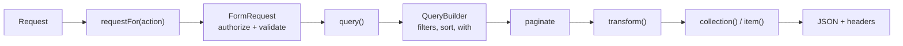
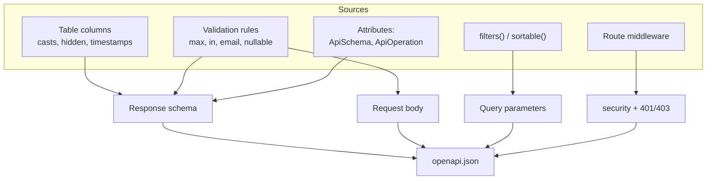
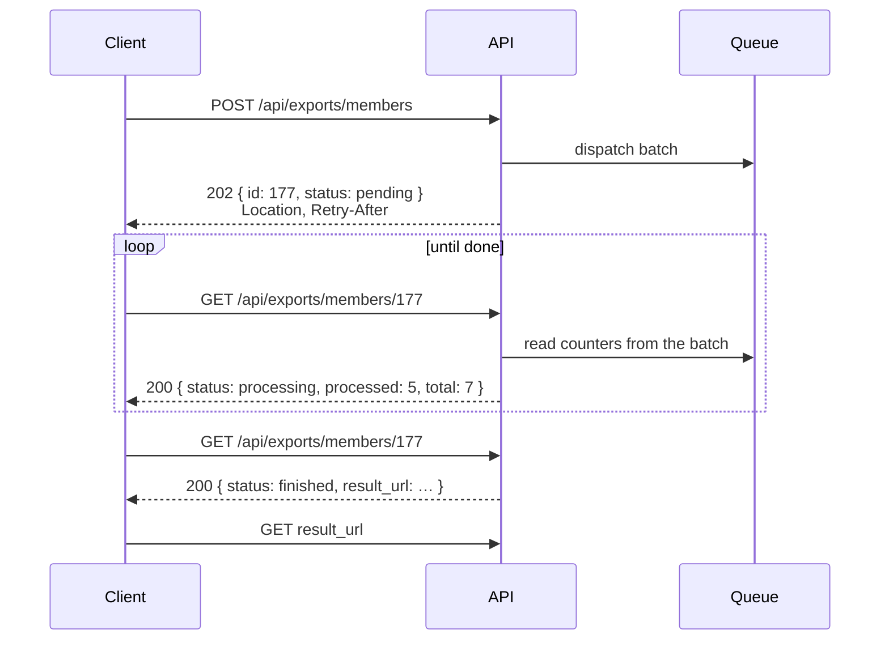
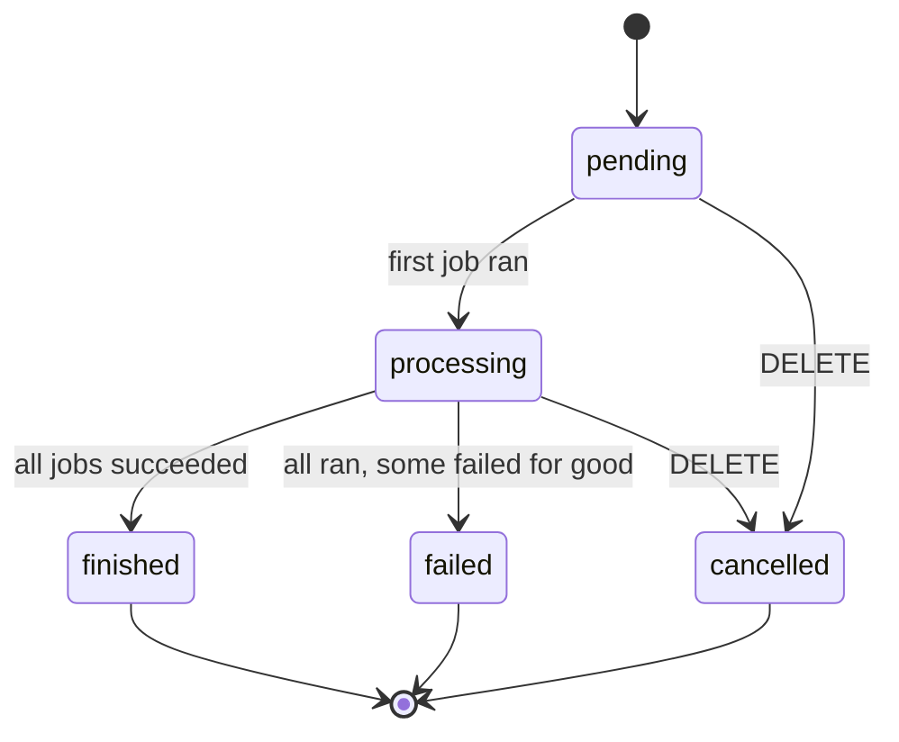

# didasto/rest-api

[](https://github.com/didasto/rest-api/actions/workflows/tests.yml)
[](https://github.com/didasto/rest-api/releases)
[](LICENSE)

**[English](README.EN.md) · [Deutsch](README.DE.md)**

Model backed and hand written REST APIs for Laravel. Routing through
attributes, an OpenAPI document generated from your request classes, and
filters you declare instead of implement.

The design rule of this package: **nothing is `final`, nothing is
`private`.** Every step of every request can be replaced on its own. See
[Extension points](#extension-points).

---

## Contents

- [Installation](#installation)
- [A model resource in three files](#a-model-resource-in-three-files)
- [How a request flows](#how-a-request-flows)
- [Filters](#filters)
- [Sorting, pagination, relations](#sorting-pagination-relations)
- [The OpenAPI document](#the-openapi-document)
- [Protected endpoints](#protected-endpoints)
- [Job APIs](#job-apis)
- [Extension points](#extension-points)
- [Configuration](#configuration)
- [Testing](#testing)

---

## Installation

```bash
composer require didasto/rest-api
php artisan migrate                 # only needed for job APIs
```

Optionally publish the configuration:

```bash
php artisan vendor:publish --tag=rest-api-config
```

> **Careful with a published config file.** It wins over the package
> defaults as a whole, so an outdated `defaults.actions` silently removes
> routes. The package throws on an unknown action name and says so.

---

## A model resource in three files

**1. The controller** says which model and which actions.

```php
use Didasto\RestApi\Attributes\RestResource;
use Didasto\RestApi\Http\Controllers\RestController;

#[RestResource(model: Member::class, uri: 'members')]
class MemberController extends RestController
{
    public function requestFor(string $action): ?string
    {
        return match ($action) {
            'index'  => MemberIndexRequest::class,
            'store'  => MemberStoreRequest::class,
            'update' => MemberUpdateRequest::class,
            default  => null,
        };
    }
}
```

**2. The listing request** declares filters and sorting.

```php
class MemberIndexRequest extends IndexRequest
{
    public function filters(): array
    {
        return [
            'id'      => IdFilter::class,
            'name'    => StringFilter::class,
            'balance' => NumericFilter::class,
            'joined'  => new DateFilter(column: 'joined_at'),
        ];
    }

    public function sortable(): array
    {
        return ['id', 'name', 'balance'];
    }
}
```

**3. The write request** declares the rules. They validate the input *and*
describe the request body in the OpenAPI document.

```php
class MemberStoreRequest extends RestRequest
{
    public function rules(): array
    {
        return [
            'name'    => ['required', 'string', 'max:120'],
            'email'   => ['required', 'email'],
            'balance' => ['numeric', 'between:0,9999.99'],
        ];
    }
}
```

That produces:

| Action    | Route                          | Name               |
|-----------|--------------------------------|--------------------|
| `index`   | `GET /api/members`             | `members.index`    |
| `show`    | `GET /api/members/{id}`        | `members.show`     |
| `store`   | `POST /api/members`            | `members.store`    |
| `update`  | `PUT\|PATCH /api/members/{id}` | `members.update`   |
| `destroy` | `DELETE /api/members/{id}`     | `members.destroy`  |

`only: ['index', 'show']` exposes just those two, `except: ['destroy']`
removes one.

`requestFor()` is the single place that knows which request belongs to
which action - handy for branching by role, tenant or API version.
Returning `null` is allowed: `index` then falls back to the plain
`IndexRequest`, `show` and `destroy` run without one, `store` and `update`
raise a clear exception rather than accepting anything.

### Responses

Flat JSON. A single record is an object, a listing is an array. Pagination
lives in the headers, so the shape of the payload never changes:

```
X-Total-Count: 42
X-Page: 2
X-Per-Page: 25
X-Last-Page: 2
Link: <…?page=1>; rel="prev", <…?page=1>; rel="first", <…?page=2>; rel="last"
```

An empty result is `200` with `[]`. The collection exists, it is merely
empty - a `404` would make "no match for this filter" indistinguishable
from "wrong URL", and many HTTP clients throw on it.

---

## How a request flows



Every box in that chain is a method you can override. The two on the right
decide what the payload looks like, the two on the left decide what is
allowed in.

---

## Filters

A filter is declared, not written. `IdFilter::class` on a field allows nine
operators on it at once:

```
?filter[id][in]=1,5,6
?filter[id][gte]=5&filter[id][lt]=99
?filter[name][startsWith]=Mei&sort=-balance
?filter[name]=Meier                      # short form, means eq
```

### Bundled filters

| Group           | Operators                                                        |
|-----------------|------------------------------------------------------------------|
| `IdFilter`      | eq, ne, lt, lte, gt, gte, in, notIn, null                          |
| `NumericFilter` | eq, ne, lt, lte, gt, gte, between, in, null                        |
| `StringFilter`  | eq, ne, like, startsWith, endsWith, in, notIn, null                |
| `DateFilter`    | eq, ne, lt, lte, gt, gte, between, null                            |
| `BooleanFilter` | eq, null                                                           |

Single filters can be mixed in freely, and a column alias is just a
constructor argument:

```php
'city'    => [new LikeFilter(), new NullFilter()],
'joined'  => new DateFilter(column: 'joined_at'),
```

`%` and `_` in a search term are escaped, with an explicit `ESCAPE` clause
so it works on SQLite and Postgres too, not only MySQL.

### Your own group

```php
class BalanceFilter extends FilterGroup
{
    public function filters(): array
    {
        return [EqualsFilter::class, GreaterThanFilter::class, BetweenFilter::class];
    }

    public function type(): string
    {
        return 'number';
    }
}
```

### Your own operator

```php
class SoundsLikeFilter extends Filter
{
    public function operator(): string
    {
        return 'soundsLike';
    }

    public function apply(Builder $query, mixed $value): Builder
    {
        return $query->whereRaw('soundex(?) = soundex('.$this->column().')', [$value]);
    }

    public function description(): string
    {
        return 'sounds like';
    }
}
```

The same declaration drives the query *and* the query parameters in the
OpenAPI document, so the two cannot drift apart.

### Rejections

Anything not declared is refused with `422` and a message naming the
alternatives:

```json
{ "message": "Unknown filter 'id[bogus]'. Allowed operators for 'id': eq, ne, lt, lte, gt, gte, in, notIn, null" }
```

---

## Sorting, pagination, relations

```
?sort=-balance,name        # minus reverses the direction
?page=2&per_page=50        # capped by defaults.max_per_page
?with=payments             # only relations listed in relations()
```

`sortable()` empty means every column is allowed. `relations()` empty
disables `?with` entirely.

---

## The OpenAPI document

`GET /api/doc` serves the current document. Route, middleware and the
included URI patterns are configurable; set `REST_API_DOC_CACHE=true` in
production.



Worth knowing:

- **Response schemas start from the table columns**, so a read only API is
  documented properly even without a single write rule. Casts win over the
  column type, enum casts become an `enum`, hidden attributes stay out, and
  the primary key and timestamps are marked `readOnly`. Without a database
  - during a build, or on `route:cache` - it falls back silently instead of
  failing.
- **Validation rules override those columns**, because they know more:
  `max:120` becomes `maxLength`, `in:a,b` becomes `enum`, `email` becomes a
  `format`.
- **Read only fields never reach a request body**, even if a rule mentions
  them. An auto incrementing primary key is not something a caller sets.
- **Filters are one `deepObject` parameter per field**, not one per
  operator. Nine rows in Swagger collapse into a single object input, and
  `additionalProperties: false` rejects an unknown operator in the document
  already.

Hand written endpoints keep using the Spatie route attributes; `#[ApiOperation]`
only supplies the documentation:

```php
#[Prefix('cash')]
class CashController
{
    #[Post('close')]
    #[ApiOperation(summary: 'Close the cash book', tag: 'Cash book')]
    public function close(CloseRequest $request): JsonResponse { … }
}
```

What a rule cannot express, `#[ApiSchema]` adds:

```php
#[ApiSchema(field: 'iban', example: 'DE02120300000000202051', format: 'iban')]
```

---

## Protected endpoints

The Authorize button comes from `openapi.security.schemes`. Which route
needs a token is derived from its middleware, so there is nothing to keep
in sync:

```php
'security' => [
    'schemes'     => ['bearerAuth' => ['type' => 'http', 'scheme' => 'bearer']],
    'middleware'  => ['auth' => 'bearerAuth', 'role' => 'bearerAuth'],
    'scopes_from' => ['role', 'can'],
],
```

`#[Middleware(['auth:api', 'role:treasurer'])]` on the route yields
`security: [{bearerAuth: ['treasurer']}]` plus the `401` and `403`
responses. `auth:api` deliberately contributes no scope - that parameter
names a guard, not a permission. Routes without a matching middleware carry
no `security` and stay callable without signing in.

---

## Job APIs

For work that takes longer than a request. `POST` starts a run and returns
its id, `GET` reports the progress.

```php
#[RestJob(key: 'member-export', uri: 'exports/members', cancellable: true)]
class MemberExportController extends JobController
{
    protected ?string $storeRequest = ExportRequest::class;
    protected ?string $dataClass    = ExportData::class;
    protected ?string $resultClass  = ExportResult::class;

    public function jobs(?JobData $data): array
    {
        return [new CollectMembersJob()];
    }

    public function resultUrl(JobRun $run): ?string
    {
        return $run->status === JobStatus::Finished
            ? route('exports.show', ['id' => $run->id])
            : null;
    }
}
```



The response has a fixed shape - no field appears or disappears:

```json
{
  "id": 177,
  "key": "member-export",
  "status": "processing",
  "total": 7,
  "processed": 5,
  "failed": 0,
  "progress": 71,
  "message": null,
  "result_url": null,
  "created_at":  "2026-09-07T21:47:15.123456Z",
  "started_at":  "2026-09-07T21:47:16.001000Z",
  "finished_at": null
}
```



### The numbers come from the batch

The jobs report nothing. Each `GET` reads the counters live from Laravel's
batch, and only once the run is done are they written down for good. Two
quirks are handled for you:

- A permanently failed job does **not** decrement `pending_jobs`, so
  Laravel never sets `finished_at` once anything failed. A run counts as
  done when `pending - failed` works out.
- `failed_jobs` is incremented on every failure while `failed_job_ids`
  stays unique. After `queue:retry` the two drift apart, so failures are
  counted by id: a job that fails three times is one failure, and one that
  finally succeeds drops out again.

Retries inside `$tries` never show up at all - the worker puts the job back
on the queue and reports a failure only after the last attempt.

### Chains and a growing total

A nested array is a chain that runs in order. That is Laravel's own batch
convention:

```php
return [
    [new SearchProductJob(), new CreateProductJob()],  // one after the other
    new CheckStockJob(),                                // alongside
];
```

A running job may append more jobs to the same batch, and `total` grows
with it:

```php
public function handle(): void
{
    // Inside handle(), always: Laravel reports this job's success only
    // afterwards, so appending later risks a moment where the run looks
    // finished.
    $this->batch()?->add([new WriteFileJob(), new NotifyBoardJob()]);
}
```

### Passing data along

Queue jobs return nothing, and what the next job needs is not known when
the batch is dispatched. So each run carries two typed objects that all its
jobs share:

```php
class ProductSearchData extends JobData
{
    public string $term;
    public ?Source $source = null;      // enums are converted too
}

class ProductSearchResult extends JobResult
{
    public ?string $asin = null;
    public ?string $gtin = null;
    public ?int $productId = null;      // every field nullable
}
```

```php
class FindAsinJob implements ShouldQueue
{
    use Batchable, Queueable, InteractsWithJobRun;

    public function handle(): void
    {
        $hit = $this->search($this->data()->term);

        $this->updateResult(function (ProductSearchResult $result) use ($hit) {
            $result->asin = $hit->asin;
        });
    }
}
```

A later job reads whatever is there, even if something failed in between:

```php
$this->updateResult(function (ProductSearchResult $result) {
    if ($result->hasAny('asin', 'gtin')) {      // gtin alone will do
        $result->productId = $this->create($result)->id;
    }
});
```

`has('asin', 'gtin')` requires all named fields, `hasAny(...)` accepts one.

> **Why a closure and not `$result->asin = …; $result->save();`?**
> Two jobs running at the same time would both hold the state from before
> they started and write it back - the slower one wins and the other one's
> fields are gone. `updateResult()` reloads the row under a lock, runs the
> closure on it and writes it back.

### Housekeeping

```bash
php artisan rest-api:prune-jobs        # removes runs older than jobs.prune days
```

---

## Extension points

This is the part the package is built around. Nothing is `final`, no method
or property is `private`, so you can replace exactly the step you care
about and leave the rest alone.

### RestController

| Method                  | Replace it to …                                           |
|-------------------------|-----------------------------------------------------------|
| `requestFor($action)`   | pick the request class per action, role, tenant, version   |
| `query()`               | scope every read - tenant, soft deletes, eager loads       |
| `find($id)`             | change how a single record is looked up                    |
| `keyName()`             | look up by slug or uuid instead of the primary key         |
| `prepare($data, $model)`| add or drop values just before writing                     |
| `persist($model)`       | wrap the write in a transaction, an event, an audit log    |
| `transform($model)`     | shape the payload - an API resource, a subset, extra fields|
| `item()`, `collection()`| change the envelope or the status code                     |
| `paginationHeaders()`   | rename or extend the pagination headers                    |
| `index()` … `destroy()` | replace a whole action                                     |

```php
class MemberController extends RestController
{
    // Only ever show the current tenant's members.
    public function query(): Builder
    {
        return parent::query()->where('tenant_id', auth()->user()->tenant_id);
    }

    // Stamp the tenant on the way in.
    public function prepare(array $data, Model $model): array
    {
        return $data + ['tenant_id' => auth()->user()->tenant_id];
    }

    // Hand out an API resource instead of the raw model.
    public function transform(Model $model): array
    {
        return (new MemberResource($model))->resolve();
    }

    // Never delete, only archive.
    public function destroy(Request $request, string|int $id): JsonResponse
    {
        $this->find($id)->update(['archived_at' => now()]);

        return new JsonResponse(null, 204);
    }
}
```

### JobController

| Method               | Replace it to …                                        |
|----------------------|--------------------------------------------------------|
| `jobs($data)`        | decide which jobs make up the run                      |
| `data($validated)`   | build the input object differently                     |
| `sanitize($data)`    | keep secrets out of the stored input                   |
| `dispatch($jobs)`    | pick a queue, a connection, add batch callbacks        |
| `resultUrl($run)`    | point at whatever the run produced                     |
| `find($id)`          | scope runs, for instance to their creator              |
| `newRun()`           | store extra columns on your own run model              |

### Filters and groups

| Class         | Replace it to …                                       |
|---------------|-------------------------------------------------------|
| `Filter`      | add an operator - `operator()`, `apply()`, `schema()` |
| `FilterGroup` | bundle operators for a field type                     |
| `FilterSet`   | change how a declaration is read                      |
| `QueryBuilder`| change how filters, sorting and paging are applied    |

### OpenAPI generator

| Method                 | Replace it to …                                     |
|------------------------|-----------------------------------------------------|
| `routes()`             | choose which routes are documented                   |
| `resourceOperation()`  | change how an action is described                    |
| `filterParameters()`   | present filters differently                          |
| `schemaFor()`          | build the response schema from another source        |
| `secure()`             | derive the security requirements differently         |
| `RuleMapper::property()`| map your own validation rules                       |
| `ModelSchema::property()`| map your own column types                          |

Bind your own class in a service provider and the whole package uses it:

```php
$this->app->bind(Generator::class, fn ($app) => new OurGenerator(
    router: $app['router'],
    mapper: $app->make(RuleMapper::class),
    config: $app['config']['rest-api'],
));
```

---

## Configuration

```php
'directories' => [
    app_path('Http/Controllers/Api') => [
        'prefix'     => 'api',
        'middleware' => ['api'],
        'patterns'   => ['*Controller.php'],
    ],
],

'defaults' => [
    'actions'      => ['index', 'show', 'store', 'update', 'destroy'],
    'parameter'    => 'id',
    'key'          => null,
    'per_page'     => 25,
    'max_per_page' => 200,
],

'query' => ['filter' => 'filter', 'sort' => 'sort', 'page' => 'page', 'per_page' => 'per_page', 'with' => 'with'],

'openapi' => [
    'route'             => 'api/doc',
    'include'           => ['api/*'],
    'exclude'           => ['api/doc'],
    'cache'             => env('REST_API_DOC_CACHE', false),
    'schema_from_model' => true,
],

'jobs' => [
    'table'       => 'api_job_runs',
    'retry_after' => 2,
    'prune'       => 30,
    'queue'       => env('REST_API_JOB_QUEUE'),
],
```

---

## Testing

```bash
composer install
composer check      # undefined variables + the test suite
```

`composer check-vars` runs a static check that `php -l` cannot do: it
reports reads of variables that were never assigned in their method. The
test suite runs against Orchestra Testbench and an in memory SQLite
database.
